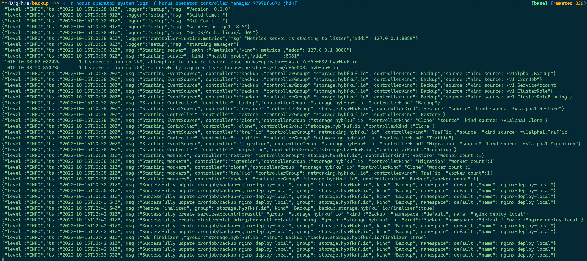
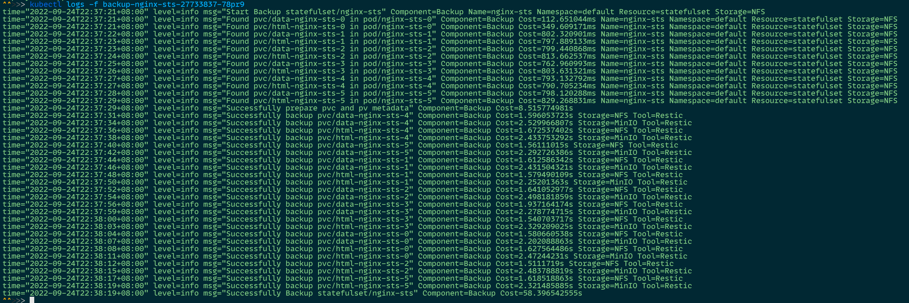

# horus-operator


An operator that uses the restic backup tools to Backup/Restore/Migration from k8s PVC to S3/Minio/Ceph/NFS.

## Description
There are five API:

- `GroupVersion: storage.hybfkuf.io/v1alpha1, Kind: Backup`
- `GroupVersion: storage.hybfkuf.io/v1alpha1, Kind: Restore`
- `GroupVersion: storage.hybfkuf.io/v1alpha1, Kind: Migration`
- `GroupVersion: storage.hybfkuf.io/v1alpha1, Kind: Clone`
- `GroupVersion: networking.hybfkuf.io/v1alpha1, Kind: Traffic`

API description:


## Backup Object examples:

```yaml
---
apiVersion: v1
kind: Secret
metadata:
  name: horus-credential
  namespace: horus-operator-system
stringData:
  RESTIC_PASSWORD: "restic"
  MINIO_ACCESS_KEY: "minioadmin"
  MINIO_SECRET_KEY: "minioadmin"
---
apiVersion: storage.hybfkuf.io/v1alpha1
kind: Backup
metadata:
  name: nginx-sts
spec:
  schedule: "*/10 * * * *"
  backupFrom:
    resource: statefulset
    name: nginx-sts
  backupTo:
    nfs:
      server: 10.250.16.21
      path: /srv/nfs/restic
    minio:
      endpoint:
        scheme: http
        address: 10.250.16.21
        port: 9000
      bucket: restic
  timezone: 'Asia/Shanghai'
  timeout: 10m
  cluster: mycluster
  credentialName: horus-credential
  logLevel: info
  logFormat: text
```


## Getting Started
You’ll need a Kubernetes cluster to run against. You can use [KIND](https://sigs.k8s.io/kind) to get a local cluster for testing, or run against a remote cluster.
**Note:** Your controller will automatically use the current context in your kubeconfig file (i.e. whatever cluster `kubectl cluster-info` shows).

### Running on the cluster
1. Install Instances of Custom Resources:

```sh
kubectl apply -f config/samples/
```

2. Build and push your image to the location specified by `IMG`:
	
```sh
make docker-build docker-push IMG=<some-registry>/horus-operator:tag
```

3. Deploy the controller to the cluster with the image specified by `IMG`:

```sh
make deploy IMG=<some-registry>/horus-operator:tag
```

### Uninstall CRDs
To delete the CRDs from the cluster:

```sh
make uninstall
```

### Undeploy controller
UnDeploy the controller to the cluster:

```sh
make undeploy
```

## Contributing
// TODO(user): Add detailed information on how you would like others to contribute to this project

### How it works
This project aims to follow the Kubernetes [Operator pattern](https://kubernetes.io/docs/concepts/extend-kubernetes/operator/)

It uses [Controllers](https://kubernetes.io/docs/concepts/architecture/controller/) 
which provides a reconcile function responsible for synchronizing resources untile the desired state is reached on the cluster 

### Test It Out
1. Install the CRDs into the cluster:

```sh
make install
```

2. Run your controller (this will run in the foreground, so switch to a new terminal if you want to leave it running):

```sh
make run
```

**NOTE:** You can also run this in one step by running: `make install run`

### Modifying the API definitions
If you are editing the API definitions, generate the manifests such as CRs or CRDs using:

```sh
make manifests
```

**NOTE:** Run `make --help` for more information on all potential `make` targets

More information can be found via the [Kubebuilder Documentation](https://book.kubebuilder.io/introduction.html)


## Snapshots





## License

Copyright 2022.

Licensed under the Apache License, Version 2.0 (the "License");
you may not use this file except in compliance with the License.
You may obtain a copy of the License at

    http://www.apache.org/licenses/LICENSE-2.0

Unless required by applicable law or agreed to in writing, software
distributed under the License is distributed on an "AS IS" BASIS,
WITHOUT WARRANTIES OR CONDITIONS OF ANY KIND, either express or implied.
See the License for the specific language governing permissions and
limitations under the License.
